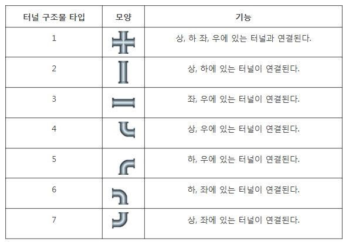

# SWEA 1953. [모의 SW 역량테스트] 탈주범 검거

## 🔗 문제 링크

- **[https://swexpertacademy.com/main/code/problem/problemDetail.do?contestProbId=AV5PzTaabHUDFAUq](https://swexpertacademy.com/main/code/problem/problemDetail.do?contestProbId=AV5PzTaabHUDFAUq)**

---

## 📝 문제 요약

- **배경**: 지하 터널 지도와 맨홀 뚜껑의 위치, 그리고 탈출 후 소요된 시간이 주어집니다. 탈주범은 맨홀을 통해 지하 터널의 한 위치로 들어갔습니다.
- **목표**: 주어진 시간 `L` 동안 탈주범이 이동할 수 있는 모든 장소의 개수를 계산해야 합니다.
- **조건**:
    1.  지하 터널은 N x M 크기의 격자 형태로 표현됩니다.
    2.  각 칸에는 터널 구조물 타입(1~7)을 나타내는 숫자가 있으며, 숫자 0은 터널이 없는 곳입니다.
    3.  각 터널 구조물은 특정 방향(상, 하, 좌, 우)으로만 연결되어 있습니다.
    4.  두 터널이 연결되려면, 현재 위치의 터널과 이동하려는 위치의 터널이 서로 이어져 있어야 합니다. (예: 현재 위치가 '상하' 터널이면 위로 이동 시, 위쪽 칸은 '상하', '하좌', '하우' 등 아래쪽으로 연결된 터널이어야 함)
    5.  탈주범은 1시간에 한 칸씩 이동할 수 있습니다.

- **터널 구조물 타입**:

    


---S

## 📥 입력

- 첫 줄에 총 테스트 케이스의 개수 `T`가 주어집니다.
- 각 테스트 케이스의 첫 줄에는 지하 터널의 세로 크기 `N`, 가로 크기 `M`, 맨홀 뚜껑의 세로 위치 `R`, 가로 위치 `C`, 그리고 탈출 후 소요된 시간 `L`이 주어집니다.
- 다음 `N`개의 줄에 걸쳐 `M`개의 숫자로 지하 터널의 정보가 주어집니다.

---

## 📤 출력

- 각 테스트 케이스마다 `#`과 테스트 케이스 번호를 출력하고, 한 칸 띄운 뒤 정답을 출력합니다.
- 정답은 탈주범이 `L`시간 동안 위치할 수 있는 장소의 총 개수입니다.

---

## 💻 예제 입력 및 출력

### 예제 입력 1
```
1
5 6 2 1 3
0 0 5 3 6 0
0 0 2 0 2 0
3 3 1 3 7 0
0 0 0 0 0 0
0 0 0 0 0 0
```

### 예제 출력 1
```
#1 5
```

### 예제 입력 2
```
1
5 6 2 2 6
3 0 0 0 6 3
2 0 0 0 2 0
1 3 1 1 3 1
2 0 2 0 2 0
0 0 4 3 1 1
```

### 예제 출력 2
```
#1 15
```